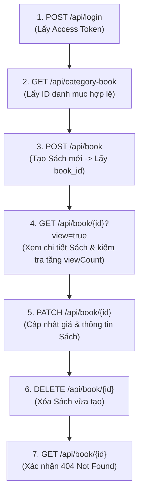

# API Test Cases: Book Management Module

> **Target API:** AnhTester Book Management API (v1.0.0)  
> **Base URL:** `https://book.anhtester.com`  
> **Auth Scheme:** Bearer Token (JWT via `Authorization: Bearer <accessToken>`)  
> **Source Spec:** `https://book.anhtester.com/swagger/json`  
> **Tag / Module:** `Book Management`  
> **Quy chuẩn áp dụng:** ISO/IEC/IEEE 29119, OWASP API Security Top 10, Equivalence Partitioning (EP), Boundary Value Analysis (BVA), `api_rules.md`.

---

## 📋 Endpoint Catalog (Module Book Management)

| # | HTTP Method | Path | Description | Security | Total Test Cases |
|---|---|---|---|---|---|
| 1 | `GET` | `/api/book` | Danh sách sách (Phân trang, Search, Sort, Filter) | Public / Optional | 12 |
| 2 | `POST` | `/api/book` | Tạo sách mới | Bearer Auth | 20 |
| 3 | `GET` | `/api/book/{id}` | Chi tiết sách theo ID (Hỗ trợ tăng `viewCount`) | Public / Optional | 7 |
| 4 | `PATCH` | `/api/book/{id}` | Cập nhật thông tin sách theo ID | Bearer Auth | 13 |
| 5 | `DELETE` | `/api/book/{id}` | Xóa sách theo ID | Bearer Auth | 6 |
| **Tổng** | | | | | **58 Test Cases** |

---

## 🔍 Test Cases Chi Tiết Theo Endpoint

### 1. `GET /api/book` — Danh Sách Sách (Pagination, Search, Sorting)

| TC ID | Scenario | Request Parameters | Expected Response | Priority | Testing Technique / Rule |
|---|---|---|---|---|---|
| `TC_BOOK_GET_001` | Happy Path — Lấy danh sách mặc định | Không truyền query params | **200 OK** Body: `list` (mảng <= 10 items), `pagination` (`total`, `totalPage`, `currentPage`: 1, `lengthData`) | P1 | Happy Path / Baseline |
| `TC_BOOK_GET_002` | Pagination — Phân trang `page=2&limit=5` | Query: `page=2&limit=5` | **200 OK** `currentPage`: 2, `lengthData` <= 5 | P1 | Equivalence Partitioning |
| `TC_BOOK_GET_003` | Search — Tìm kiếm theo tên/mô tả sách | Query: `search=Clean Code` | **200 OK** Tất cả sách trong `list` có tên hoặc description chứa "Clean Code" | P1 | Functional Testing |
| `TC_BOOK_GET_004` | Search — Tìm kiếm từ khóa không tồn tại | Query: `search=non_existent_book_999` | **200 OK** `list`: `[]`, `pagination.total`: 0 | P2 | Boundary Value Analysis |
| `TC_BOOK_GET_005` | Sorting — Sắp xếp theo giá (`price`) tăng dần | Query: `sort=price&sortBy=asc` | **200 OK** `list` có giá sách tăng dần từ nhỏ tới lớn | P2 | Functional Testing |
| `TC_BOOK_GET_006` | Sorting — Sắp xếp theo `viewCount` giảm dần | Query: `sort=viewCount&sortBy=desc` | **200 OK** `list` có sách được xem nhiều nhất xếp ở đầu | P2 | Functional Testing |
| `TC_BOOK_GET_007` | Sorting — Sắp xếp theo `updatedAt` giảm dần (mặc định) | Query: `sort=updatedAt&sortBy=desc` | **200 OK** `list` được cập nhật mới nhất nằm ở đầu | P2 | Functional Testing |
| `TC_BOOK_GET_008` | Boundary — `page=99999` vượt tổng số trang | Query: `page=99999` | **200 OK** `list`: `[]`, `currentPage`: 99999 | P2 | Boundary Value Analysis |
| `TC_BOOK_GET_009` | Negative — `sort` truyền trường không hỗ trợ | Query: `sort=invalid_column` | **400 Bad Request** / **422 Unprocessable Entity** | P3 | Input Validation |
| `TC_BOOK_GET_010` | Security — XSS Payload trong query `search` | Query: `search=` | **200 OK** Sanitized / Kết quả rỗng, không thực thi script | P2 | OWASP API8: Injection |
| `TC_BOOK_GET_011` | Unrestricted Resource Consumption — Spaming 100 requests | 100 Loop GET requests trong 1s | **429 Too Many Requests** / Rate limit header | P2 | OWASP API4: Unrestricted Resource Consumption |
| `TC_BOOK_GET_012` | Header — Content Negotiation (`Accept: application/xml`) | Header: `Accept: application/xml` | **406 Not Acceptable** hoặc **200 OK** (JSON default) | P3 | Protocol Standard |

---

### 2. `POST /api/book` — Tạo Sách Mới

| TC ID | Scenario | Request Body / Headers | Expected Response | Priority | Testing Technique / Rule |
|---|---|---|---|---|---|
| `TC_BOOK_POST_001` | Happy Path — Tạo sách đầy đủ tất cả thuộc tính | Header: `Authorization: Bearer <valid_token>` Body: `{ "name": "Clean Code Java", "slug": "clean-code-java", "description": "Sách hướng dẫn viết code sạch", "status": "AVAILABLE", "categories": ["Category_ID_1"], "price": 150000, "pictures": ["https://img.com/book.jpg"] }` | **201 Created** Body: `{ "msg": "Book created successfully" }` (hoặc book ID) | P1 | Happy Path |
| `TC_BOOK_POST_002` | Happy Path — Tạo sách chỉ có các trường bắt buộc (`name`, `status`, `categories`, `price`) | Body: `{ "name": "Refactoring", "status": "AVAILABLE", "categories": ["Category_ID_1"], "price": 120000 }` | **201 Created** | P1 | Equivalence Partitioning |
| `TC_BOOK_POST_003` | Negative — Auth: Không gửi Bearer Token | Header: Không có `Authorization` | **401 Unauthorized** / **403 Forbidden** | P1 | OWASP API2: Broken Auth |
| `TC_BOOK_POST_004` | Negative — Auth: Token không hợp lệ | Header: `Authorization: Bearer invalid_token` | **401 Unauthorized** | P1 | OWASP API2: Broken Auth |
| `TC_BOOK_POST_005` | Field "name" — Thiếu required field `name` | Body: `{ "status": "AVAILABLE", "categories": ["Cat1"], "price": 50000 }` | **400 Bad Request** / **422 Unprocessable Entity** | P1 | Field Validation |
| `TC_BOOK_POST_006` | Field "name" — Empty string / Whitespace | Body: `{ "name": "   ", "status": "AVAILABLE", "categories": ["Cat1"], "price": 50000 }` | **400 / 422** | P2 | Boundary Value Analysis |
| `TC_BOOK_POST_007` | Field "categories" — Thiếu required field `categories` | Body: `{ "name": "Book No Cat", "status": "AVAILABLE", "price": 50000 }` | **400 / 422** | P1 | Field Validation |
| `TC_BOOK_POST_008` | Field "categories" — Mảng rỗng `[]` (Vi phạm `minItems: 1`) | Body: `{ "name": "Book Empty Cat", "status": "AVAILABLE", "categories": [], "price": 50000 }` | **400 / 422** Lỗi danh mục phải có ít nhất 1 phần tử | P1 | Schema MinItems Constraint |
| `TC_BOOK_POST_009` | Field "price" — Thiếu required field `price` | Body: `{ "name": "Book No Price", "status": "AVAILABLE", "categories": ["Cat1"] }` | **400 / 422** | P1 | Field Validation |
| `TC_BOOK_POST_010` | Field "price" — Giá số âm (`price: -100`) | Body: `{ "name": "Book Negative Price", "status": "AVAILABLE", "categories": ["Cat1"], "price": -100 }` | **400 / 422** | P1 | Boundary Value Analysis |
| `TC_BOOK_POST_011` | Field "price" — Giá vượt mức tối đa (`price: 999999999999999`) | Body: `{ "name": "Over Price", "status": "AVAILABLE", "categories": ["Cat1"], "price": 999999999999999 }` | **400 / 422** (Vượt max `9000000000000`) | P2 | Boundary Value Analysis |
| `TC_BOOK_POST_012` | Field "status" — Giá trị ngoài Enum (không phải `AVAILABLE` / `UNAVAILABLE`) | Body: `{ "name": "Invalid Status", "status": "PENDING", "categories": ["Cat1"], "price": 50000 }` | **400 / 422** | P1 | Enum Validation |
| `TC_BOOK_POST_013` | Security — SQL Injection trong `name` | Body: `{ "name": "' OR 1=1; DROP TABLE books;--", "status": "AVAILABLE", "categories": ["Cat1"], "price": 50000 }` | **201 Created** (xem như string thường) hoặc **400** | P2 | OWASP API8: Injection |
| `TC_BOOK_POST_014` | Security — XSS Payload trong `description` | Body: `{ "name": "XSS Book", "description": "<svg onload=alert(1)>", "status": "AVAILABLE", "categories": ["Cat1"], "price": 50000 }` | **201 Created** (Sanitized) / **400** | P2 | OWASP API8: Injection |
| `TC_BOOK_POST_015` | Security — Mass Assignment (Gửi thuộc tính hệ thống `id`, `viewCount`, `createdAt`) | Body: `{ "name": "Hack Book", "status": "AVAILABLE", "categories": ["Cat1"], "price": 50000, "viewCount": 999999, "id": "custom_id" }` | **201 Created** (nhưng bỏ qua `viewCount`/`id`) hoặc **400** | P1 | OWASP API6: Mass Assignment |
| `TC_BOOK_POST_016` | Header — Content-Type Mismatch (`text/plain`) | Header: `Content-Type: text/plain` | **415 Unsupported Media Type** | P2 | Protocol Standard |
| `TC_BOOK_POST_017` | Malformed JSON — Cú pháp JSON lỗi | Body: `{ "name": "Test Book", "price": }` | **400 Bad Request** (JSON Parse Error) | P2 | Syntax Validation |
| `TC_BOOK_POST_018` | Oversized Payload — JSON body > 10MB | Body chứa description chuỗi 15MB | **413 Payload Too Large** | P3 | System Limits |
| `TC_BOOK_POST_019` | Concurrency — 2 Request POST tạo trùng slug/name cùng lúc | 2 Parallel threads gửi cùng 1 tên sách | 1 Request **201 Created**, 1 Request **409 Conflict** | P2 | Race Condition / Concurrency |
| `TC_BOOK_POST_020` | Field "categories" — Truyền danh mục ID không tồn tại | Body: `{ "name": "Invalid Cat", "status": "AVAILABLE", "categories": ["non_existent_cat_999"], "price": 50000 }` | **400 Bad Request** / **404 Not Found** | P1 | Foreign Key Integrity |

---

### 3. `GET /api/book/{id}` — Chi Tiết Sách Theo ID

| TC ID | Scenario | Request Parameters | Expected Response | Priority | Testing Technique / Rule |
|---|---|---|---|---|---|
| `TC_BOOK_GET_ID_001` | Happy Path — Lấy chi tiết sách tồn tại (`view=false`) | Path: `id`: ID sách hợp lệ Query: `view=false` | **200 OK** Body: `{ "id", "name", "description", "price", "currentPrice", "viewCount", "status", "categories", "promotions", ... }` | P1 | Happy Path |
| `TC_BOOK_GET_ID_002` | View Increment — Lấy chi tiết sách kèm tăng lượt xem (`view=true`) | Path: `id`: ID sách hợp lệ Query: `view=true` | **200 OK** `viewCount` mới = `viewCount` cũ + 1 | P1 | Business Logic / State Change |
| `TC_BOOK_GET_ID_003` | Schema Validation — Response khớp cấu trúc | Path: `id`: ID hợp lệ | **200 OK** Tất cả các thuộc tính bắt buộc có trong schema | P1 | Schema Verification |
| `TC_BOOK_GET_ID_004` | Negative — `id` không tồn tại | Path: `id`: `non_existent_book_id_999` | **404 Not Found** Body: `{ "msg": "Book not found" }` (hoặc tương tự) | P1 | Negative Testing |
| `TC_BOOK_GET_ID_005` | Negative — `id` rỗng hoặc ký tự đặc biệt | Path: `id`: `!@#$%^&*()` | **400 Bad Request** / **404 Not Found** | P2 | Boundary Value Analysis |
| `TC_BOOK_GET_ID_006` | Security — SQL Injection trong path `id` | Path: `id`: `1' OR '1'='1` | **400 Bad Request** / **404 Not Found** | P2 | OWASP API8: Injection |
| `TC_BOOK_GET_ID_007` | Security — Sensitive Data Exposure Check | Path: `id`: ID hợp lệ | **200 OK** Xác nhận Response **KHÔNG làm lộ** thông tin tác giả nhạy cảm | P1 | OWASP API3: Property Level Auth |

---

### 4. `PATCH /api/book/{id}` — Cập Nhật Sách Theo ID

| TC ID | Scenario | Request Body / Headers | Expected Response | Priority | Testing Technique / Rule |
|---|---|---|---|---|---|
| `TC_BOOK_PATCH_001` | Happy Path — Cập nhật tên và giá sách | Path: `id` hợp lệ Header: `Authorization: Bearer <valid_token>` Body: `{ "name": "Clean Code 2nd Edition", "price": 180000 }` | **200 OK** Body: `{ "msg": "Book updated successfully" }` | P1 | Happy Path |
| `TC_BOOK_PATCH_002` | Partial Update Check — Các trường không gửi được giữ nguyên | Gửi PATCH chỉ sửa `description` Sau đó `GET /api/book/{id}` | **200 OK** `description` đổi mới, `name`, `price`, `categories` giữ nguyên | P1 | PUT vs PATCH Standard |
| `TC_BOOK_PATCH_003` | State Change — Đổi trạng thái từ `AVAILABLE` sang `UNAVAILABLE` | Body: `{ "status": "UNAVAILABLE" }` | **200 OK** | P1 | State Transition |
| `TC_BOOK_PATCH_004` | Negative — Auth: Không gửi Bearer Token | Header: Không có `Authorization` | **401 Unauthorized** / **403 Forbidden** | P1 | OWASP API2: Broken Auth |
| `TC_BOOK_PATCH_005` | Security — BOLA / IDOR (Sửa sách do user/tác giả khác quản lý) | Token của User A, nhưng truyền `id` cuốn sách của User B | **403 Forbidden** (nếu hệ thống có phân quyền quản lý sách) | P1 | OWASP API1: BOLA / IDOR |
| `TC_BOOK_PATCH_006` | Negative — `id` không tồn tại | Path: `id`: `invalid_book_id_999` | **404 Not Found** | P1 | Negative Testing |
| `TC_BOOK_PATCH_007` | Field Validation — Cập nhật `price` thành số âm (`-5000`) | Body: `{ "price": -5000 }` | **400 Bad Request** / **422 Unprocessable Entity** | P1 | Boundary Value Analysis |
| `TC_BOOK_PATCH_008` | Field Validation — Cập nhật `status` thành giá trị ngoài Enum | Body: `{ "status": "DISCONTINUED" }` | **400 / 422** | P1 | Enum Validation |
| `TC_BOOK_PATCH_009` | Field Validation — Cập nhật `categories` thành mảng rỗng `[]` | Body: `{ "categories": [] }` | **400 / 422** (Vi phạm `minItems: 1`) | P1 | Schema Constraint |
| `TC_BOOK_PATCH_010` | Boundary — Request body rỗng `{}` | Body: `{}` | **200 OK** (không đổi gì) hoặc **400 Bad Request** | P3 | Edge Case |
| `TC_BOOK_PATCH_011` | Security — Mass Assignment (Cố tình cập nhật `viewCount`, `createdAt`) | Body: `{ "viewCount": 99999, "createdAt": "2000-01-01T00:00:00Z" }` | **200 OK** (ignore field nhạy cảm) hoặc **400** | P1 | OWASP API6: Mass Assignment |
| `TC_BOOK_PATCH_012` | Header — Content-Type Mismatch (`text/plain`) | Header: `Content-Type: text/plain` | **415 Unsupported Media Type** | P2 | Protocol Standard |
| `TC_BOOK_PATCH_013` | Foreign Key Check — Cập nhật `categories` chứa ID không tồn tại | Body: `{ "categories": ["fake_cat_id_999"] }` | **400 Bad Request** / **404 Not Found** | P1 | Data Integrity |

---

### 5. `DELETE /api/book/{id}` — Xóa Sách Theo ID

| TC ID | Scenario | Request / Headers | Expected Response | Priority | Testing Technique / Rule |
|---|---|---|---|---|---|
| `TC_BOOK_DELETE_001` | Happy Path — Xóa sách tồn tại thành công | Path: `id` của cuốn sách vừa tạo Header: `Authorization: Bearer <valid_token>` | **200 OK** Body: `{ "msg": "Book deleted successfully" }` | P1 | Happy Path |
| `TC_BOOK_DELETE_002` | Verification — Gọi GET lại sau khi DELETE | Sau khi DELETE thành công, gọi `GET /api/book/{id}` | **404 Not Found** | P1 | State Verification |
| `TC_BOOK_DELETE_003` | Security — BOLA / IDOR (Xóa sách của người dùng khác) | Token của User A, nhưng truyền `id` cuốn sách của User B | **403 Forbidden** | P1 | OWASP API1: BOLA / IDOR |
| `TC_BOOK_DELETE_004` | Negative — Auth: Không gửi Bearer Token | Header: Không có `Authorization` | **401 Unauthorized** / **403 Forbidden** | P1 | OWASP API2: Broken Auth |
| `TC_BOOK_DELETE_005` | Negative — Xóa sách không tồn tại | Path: `id`: `deleted_or_fake_book_id_999` | **404 Not Found** | P2 | Negative Testing |
| `TC_BOOK_DELETE_006` | Idempotency Check — Xóa lặp lại cùng 1 Book ID 2 lần liên tiếp | Lần 1: **200 OK** Lần 2 (ngay sau đó): **404 Not Found** | **404 Not Found** ở lần 2 | P2 | Idempotency Check |

---

## 🔄 Dependencies & Execution Order (Chuỗi Phụ Thuộc)

---

## 📊 Test Data Matrix cho Module Book Management

| Field | Valid Example | Invalid Example | Boundary Example | Security & Protocol Payload |
|---|---|---|---|---|
| `name` | `"Clean Code Java"` | `""` (empty), `"   "` (whitespace) | 1 char, 255 chars | `""`, `' OR 1=1--` |
| `description` | `"Sách hướng dẫn lập trình"` | — | Long text (10,000 chars) | `"<svg onload=alert(1)>"` |
| `categories` | `["cat_id_123"]` | `[]` (empty array), `"not_an_array"` | `["non_existent_id"]` | — |
| `price` | `150000` | `-100` (âm), `"abc"` (string) | `0`, `9000000000000` (max) | `999999999999999` (over max) |
| `status` | `"AVAILABLE"`, `"UNAVAILABLE"` | `"PENDING"`, `"INVALID"` | Case sensitivity: `"available"` | — |
| `pictures` | `["https://img.com/b.jpg"]` | `["not_a_valid_url"]` | `[]` | `"javascript:alert(1)"` |
| `Headers` | `Content-Type: application/json` | `Content-Type: text/plain` | `Accept: application/xml` | Missing Auth Token / Invalid Token |
