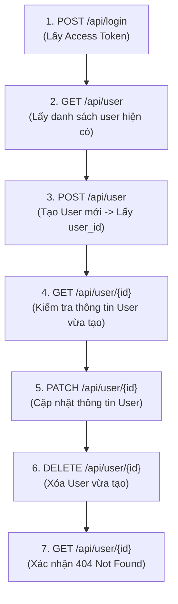

# API Test Cases: User Management Module (Comprehensive Suite)

> **Target API:** AnhTester Book Management API (v1.0.0)  
> **Base URL:** `https://book.anhtester.com`  
> **Auth Scheme:** Bearer Token (JWT via `Authorization: Bearer <accessToken>`)  
> **Source Spec:** `https://book.anhtester.com/swagger/json`  
> **Quy chuẩn áp dụng:** ISO/IEC/IEEE 29119, OWASP API Security Top 10, Equivalence Partitioning (EP), Boundary Value Analysis (BVA), Error Guessing, `api_rules.md`.

---

## 📋 Endpoint Catalog (Module User Management)

| # | HTTP Method | Path | Description | Security | Total Test Cases |
|---|---|---|---|---|---|
| 1 | `GET` | `/api/user` | Danh sách users (Phân trang, Search, Sort) | Public / Optional | 12 |
| 2 | `POST` | `/api/user` | Tạo người dùng mới | Bearer Auth | 19 |
| 3 | `GET` | `/api/user/{id}` | Xem thông tin chi tiết user theo ID | Public / Optional | 6 |
| 4 | `PATCH` | `/api/user/{id}` | Cập nhật thông tin user theo ID | Bearer Auth | 12 |
| 5 | `DELETE` | `/api/user/{id}` | Xóa user theo ID | Bearer Auth | 5 |
| **Tổng** | | | | | **54 Test Cases** |

---

## 🔍 Test Cases Chi Tiết Theo Endpoint

### 1. `GET /api/user` — Danh sách Users

| TC ID | Scenario | Request Parameters | Expected Response | Priority | Testing Technique / Rule |
|---|---|---|---|---|---|
| `TC_USER_GET_001` | Happy Path — Lấy danh sách mặc định | Không truyền query params | **200 OK** Body: `list` (mảng <= 10 items), `pagination` (`total`, `totalPage`, `currentPage`: 1, `lengthData`) | P1 | Happy Path / Baseline |
| `TC_USER_GET_002` | Pagination — Phân trang `page=2&limit=5` | Query: `page=2&limit=5` | **200 OK** `currentPage`: 2, `lengthData` <= 5 | P1 | Equivalence Partitioning |
| `TC_USER_GET_003` | Search — Tìm kiếm theo tên | Query: `search=AnhTester` | **200 OK** Tất cả users trong `list` có chứa từ khóa "AnhTester" trong `name` hoặc `email` | P1 | Functional Testing |
| `TC_USER_GET_004` | Search — Tìm kiếm từ khóa không tồn tại | Query: `search=xyz_not_exist_999` | **200 OK** `list`: `[]`, `pagination.total`: 0 | P2 | Boundary Value Analysis |
| `TC_USER_GET_005` | Sorting — Sắp xếp theo tên tăng dần | Query: `sort=name&sortBy=asc` | **200 OK** `list` sắp xếp theo thứ tự `name` từ A-Z | P2 | Functional Testing |
| `TC_USER_GET_006` | Sorting — Sắp xếp theo `createdAt` giảm dần | Query: `sort=createdAt&sortBy=desc` | **200 OK** `list` sắp xếp theo ngày tạo mới nhất lên đầu | P2 | Functional Testing |
| `TC_USER_GET_007` | Boundary — `page=99999` vượt tổng số trang | Query: `page=99999` | **200 OK** `list`: `[]`, `currentPage`: 99999 | P2 | Boundary Value Analysis |
| `TC_USER_GET_008` | Negative — `limit=0` hoặc số âm | Query: `limit=-1` | **400 Bad Request** hoặc **422 Unprocessable Entity** | P3 | Input Validation |
| `TC_USER_GET_009` | Negative — `sort` truyền trường không tồn tại | Query: `sort=invalid_field` | **400 Bad Request** / Error message | P3 | Input Validation |
| `TC_USER_GET_010` | Security — XSS Payload trong query param `search` | Query: `search=` | **200 OK** Sanitized / Kết quả rỗng, không thực thi script | P2 | OWASP API8: Injection |
| `TC_USER_GET_011` | Rate Limiting — Gửi 100 requests liên tục trong 1 giây | Loop 100 GET requests | **429 Too Many Requests** (nếu có Rate Limiter) hoặc Header `X-RateLimit-Remaining` giảm dần | P2 | OWASP API4: Unrestricted Resource Consumption |
| `TC_USER_GET_012` | Header — Content Negotiation (`Accept: application/xml`) | Header: `Accept: application/xml` | **406 Not Acceptable** hoặc **200 OK** (trả JSON mặc định) | P3 | Protocol Standard / HTTP Header |

---

### 2. `POST /api/user` — Tạo User Mới

| TC ID | Scenario | Request Body / Headers | Expected Response | Priority | Testing Technique / Rule |
|---|---|---|---|---|---|
| `TC_USER_POST_001` | Happy Path — Tạo user với đầy đủ các trường | Header: `Authorization: Bearer <valid_token>` Body: `{ "name": "Auto User", "email": "auto_user_1712049200@test.com", "password": "password123", "phone": "0987654321", "address": "Hà Nội", "isActive": true }` | **201 Created** Body: `{ "msg": "User created successfully" }` (hoặc object user) | P1 | Happy Path |
| `TC_USER_POST_002` | Happy Path — Tạo user chỉ có required fields (`name`, `email`) | Body: `{ "name": "Minimal User", "email": "auto_min_1712049200@test.com" }` | **201 Created** Password tự động dùng default `anhtester.com` | P1 | Equivalence Partitioning |
| `TC_USER_POST_003` | Negative — Auth: Không gửi Bearer Token | Header: Không có `Authorization` | **401 Unauthorized** / **403 Forbidden** | P1 | OWASP API2: Broken Authentication |
| `TC_USER_POST_004` | Negative — Auth: Token không hợp lệ / hết hạn | Header: `Authorization: Bearer invalid_token_123` | **401 Unauthorized** | P1 | OWASP API2: Broken Authentication |
| `TC_USER_POST_005` | Field "name" — Thiếu required field `name` | Body: `{ "email": "noname@test.com" }` | **400 Bad Request** / **422 Unprocessable Entity** | P1 | Field-Level Validation |
| `TC_USER_POST_006` | Field "name" — Empty string / Whitespace | Body: `{ "name": "   ", "email": "test@test.com" }` | **400 / 422** | P2 | Boundary Value Analysis |
| `TC_USER_POST_007` | Field "email" — Thiếu required field `email` | Body: `{ "name": "No Email" }` | **400 / 422** | P1 | Field-Level Validation |
| `TC_USER_POST_008` | Field "email" — Sai định dạng email | Body: `{ "name": "Test", "email": "invalid_email_format" }` | **400 / 422** | P1 | Syntax Validation |
| `TC_USER_POST_009` | Field "email" — Email trùng lặp | Body: Email của user đã tồn tại trong DB | **400 / 409 Conflict** | P1 | Business Logic / Data Integrity |
| `TC_USER_POST_010` | Field "isActive" — Gửi sai data type (string thay vì boolean) | Body: `{ "name": "Test", "email": "valid@test.com", "isActive": "yes" }` | **400 / 422** | P2 | Type Mismatch Validation |
| `TC_USER_POST_011` | Field "avatarUrl" — URL sai định dạng | Body: `{ "name": "Test", "email": "valid@test.com", "avatarUrl": "not_a_valid_url" }` | **400 / 422** | P2 | Format Validation |
| `TC_USER_POST_012` | Field "password" — Password siêu dài (10,000 chars) | Body: `{ "name": "Test", "email": "longpass@test.com", "password": "A".repeat(10000) }` | **400 / 422** (Ngăn ngừa ReDoS/Memory Exhaustion) | P2 | OWASP API4 / Stress Test |
| `TC_USER_POST_013` | Security — SQL Injection trong `name` | Body: `{ "name": "' OR 1=1--", "email": "sqli_1712049200@test.com" }` | **201 Created** (xem như string thường) hoặc **400** | P2 | OWASP API8: Injection |
| `TC_USER_POST_014` | Security — XSS Payload trong `address` | Body: `{ "name": "XSS Test", "email": "xss_1712049200@test.com", "address": "" }` | **201 Created** (Sanitized) / **400** | P2 | OWASP API8: Injection |
| `TC_USER_POST_015` | Security — Mass Assignment (Gửi trường nhạy cảm không phép) | Body: `{ "name": "Hacker", "email": "hacker@test.com", "role": "ADMIN", "isAdmin": true, "id": "custom_id_123" }` | **201 Created** (nhưng bỏ qua `role`/`isAdmin`/`id`) hoặc **400** | P1 | OWASP API6: Mass Assignment |
| `TC_USER_POST_016` | Header — Sai `Content-Type` (`text/plain`) | Header: `Content-Type: text/plain` | **415 Unsupported Media Type** / **400 Bad Request** | P2 | Protocol Standard |
| `TC_USER_POST_017` | Malformed JSON — Cú pháp JSON bị lỗi | Body: `{ "name": "Test", "email": }` | **400 Bad Request** (JSON Parse Error) | P2 | Error Handling |
| `TC_USER_POST_018` | Payload Size — Payload vượt quá giới hạn (e.g. > 10MB) | Body JSON dung lượng 15MB | **413 Payload Too Large** | P3 | System Limits |
| `TC_USER_POST_019` | Concurrency — 2 Request POST tạo cùng 1 email gửi đồng thời | 2 Parallel threads gửi cùng 1 email tại cùng 1 milisecond | 1 Request trả về **201 Created**, 1 Request trả về **409 Conflict** | P2 | Race Condition / Concurrency |

---

### 3. `GET /api/user/{id}` — Chi Tiết User Theo ID

| TC ID | Scenario | Path Parameter | Expected Response | Priority | Testing Technique / Rule |
|---|---|---|---|---|---|
| `TC_USER_GET_ID_001` | Happy Path — Lấy thông tin user tồn tại | `id`: ID hợp lệ của user sẵn có | **200 OK** Body: `{ "id", "name", "email", "avatarUrl", "phone", "address", "isActive", "createdAt", "updatedAt" }` | P1 | Happy Path |
| `TC_USER_GET_ID_002` | Schema Check — Kiểm tra đầy đủ các thuộc tính trong Response | `id`: ID hợp lệ | **200 OK** Các trường `id`, `name`, `email`, `isActive`, `createdAt`, `updatedAt` không bị null | P1 | Schema Validation |
| `TC_USER_GET_ID_003` | Negative — `id` không tồn tại | `id`: `non_exist_user_id_99999` | **404 Not Found** Body: `{ "msg": "User not found" }` | P1 | Negative Testing |
| `TC_USER_GET_ID_004` | Negative — `id` rỗng hoặc ký tự đặc biệt | `id`: `!@#$%^&*()` | **400 Bad Request** / **404 Not Found** | P2 | Boundary Value Analysis |
| `TC_USER_GET_ID_005` | Security — SQL Injection trong path `id` | `id`: `1' OR '1'='1` | **400 Bad Request** / **404 Not Found** | P2 | OWASP API8: Injection |
| `TC_USER_GET_ID_006` | Security — Sensitive Data Exposure Check | `id`: ID hợp lệ | **200 OK** Xác nhận Response **KHÔNG chứa** `password`, `hash`, `token`, hoặc `secretKey` | P1 | OWASP API3: Broken Object Property Level Authorization |

---

### 4. `PATCH /api/user/{id}` — Cập Nhật User Theo ID

| TC ID | Scenario | Request | Expected Response | Priority | Testing Technique / Rule |
|---|---|---|---|---|---|
| `TC_USER_PATCH_001` | Happy Path — Cập nhật tên và số điện thoại | Path: `id` hợp lệ Header: `Authorization: Bearer <valid_token>` Body: `{ "name": "Updated Name", "phone": "0912345678" }` | **200 OK** Body: `{ "msg": "User updated successfully" }` | P1 | Happy Path |
| `TC_USER_PATCH_002` | Partial Update Check — Các trường không gửi giữ nguyên | Gửi PATCH chỉ cập nhật `address` Sau đó `GET /api/user/{id}` | **200 OK** Trường `address` đổi mới, `name` và `email` giữ nguyên | P1 | PUT vs PATCH Standard |
| `TC_USER_PATCH_003` | Happy Path — Đổi trạng thái `isActive` thành `false` | Body: `{ "isActive": false }` | **200 OK** | P1 | Functional Testing |
| `TC_USER_PATCH_004` | Negative — Auth: Không gửi Bearer Token | Header: Không có `Authorization` | **401 Unauthorized** / **403 Forbidden** | P1 | OWASP API2: Broken Authentication |
| `TC_USER_PATCH_005` | Security — BOLA / IDOR (Sửa profile của User khác) | Token của User A, nhưng truyền `id` của User B trong URL | **403 Forbidden** (User không có quyền sửa tài khoản khác) | P1 | OWASP API1: Broken Object Level Authorization (BOLA/IDOR) |
| `TC_USER_PATCH_006` | Negative — `id` không tồn tại | Path: `id`: `invalid_id_999` | **404 Not Found** | P1 | Negative Testing |
| `TC_USER_PATCH_007` | Negative — Cập nhật email thành email trùng với user khác | Body: `{ "email": "existing_other_user@test.com" }` | **400 Bad Request** / **409 Conflict** | P1 | Business Logic |
| `TC_USER_PATCH_008` | Negative — Cập nhật email sai định dạng | Body: `{ "email": "not_an_email" }` | **400 / 422** | P2 | Format Validation |
| `TC_USER_PATCH_009` | Boundary — Request body rỗng `{}` | Body: `{}` | **200 OK** (không đổi gì) hoặc **400 Bad Request** | P3 | Edge Case |
| `TC_USER_PATCH_010` | Security — Mass Assignment (Truyền field `role` / `createdAt`) | Body: `{ "role": "SUPER_ADMIN", "createdAt": "2000-01-01T00:00:00Z" }` | **200 OK** (ignore các field này) hoặc **400** | P1 | OWASP API6: Mass Assignment |
| `TC_USER_PATCH_011` | Security — Revoke Refresh Tokens khi thay đổi password | PATCH thay đổi `password` Dùng token/refresh token cũ thực hiện request | **401 Unauthorized** | P1 | Token Lifecycle Security |
| `TC_USER_PATCH_012` | Header — Content-Type Mismatch | Header: `Content-Type: text/plain` | **415 Unsupported Media Type** | P2 | Protocol Standard |

---

### 5. `DELETE /api/user/{id}` — Xóa User Theo ID

| TC ID | Scenario | Request | Expected Response | Priority | Testing Technique / Rule |
|---|---|---|---|---|---|
| `TC_USER_DELETE_001` | Happy Path — Xóa user tồn tại thành công | Path: `id` của user vừa tạo Header: `Authorization: Bearer <valid_token>` | **200 OK** Body: `{ "msg": "User deleted successfully" }` | P1 | Happy Path |
| `TC_USER_DELETE_002` | Verification — Gọi GET lại sau khi DELETE | Sau khi DELETE thành công, gọi `GET /api/user/{id}` | **404 Not Found** | P1 | State Verification |
| `TC_USER_DELETE_003` | Security — BOLA / IDOR (Xóa tài khoản của User khác) | Token của User A, nhưng truyền `id` của User B | **403 Forbidden** | P1 | OWASP API1: BOLA / IDOR |
| `TC_USER_DELETE_004` | Negative — Xóa user không tồn tại | Path: `id`: `deleted_or_fake_id_999` | **404 Not Found** | P2 | Negative Testing |
| `TC_USER_DELETE_005` | Idempotency Check — Xóa lặp lại cùng 1 ID 2 lần liên tiếp | Lần 1: **200 OK** Lần 2 (ngay sau đó): **404 Not Found** | **404 Not Found** ở lần 2 | P2 | Idempotency Check |

---

## 🔄 Dependencies & Execution Order (Chuỗi Phụ Thuộc)

---

## 📊 Test Data Matrix Nâng Cao

| Field | Valid Example | Invalid Example | Boundary Example | Security & Protocol Payload |
|---|---|---|---|---|
| `name` | `"Nguyen Van A"` | `""` (empty), `"   "` (whitespace) | `"A"` (1 char), 255 chars | `""`, `' OR 1=1--` |
| `email` | `"auto_user_1712049200@test.com"` | `"user@domain"`, `"no_at_sign.com"` | Shortest valid email: `"a@b.co"` | `' OR 1=1--` |
| `password` | `"password123"` | `""` | Default: `"anhtester.com"` | `"A".repeat(10000)` (ReDoS Check) |
| `phone` | `"0912345678"` | `"abc_not_number"` | `"0"` | `"+84912345678"` |
| `avatarUrl` | `"https://example.com/avatar.jpg"` | `"not_a_valid_url"` | `"ftp://server/file"` | `"javascript:alert(1)"` |
| `isActive` | `true` / `false` | `"yes"` (string) | `null` | — |
| `Headers` | `Content-Type: application/json` | `Content-Type: text/plain` | `Accept: application/xml` | Missing Auth Token / Invalid Token |
